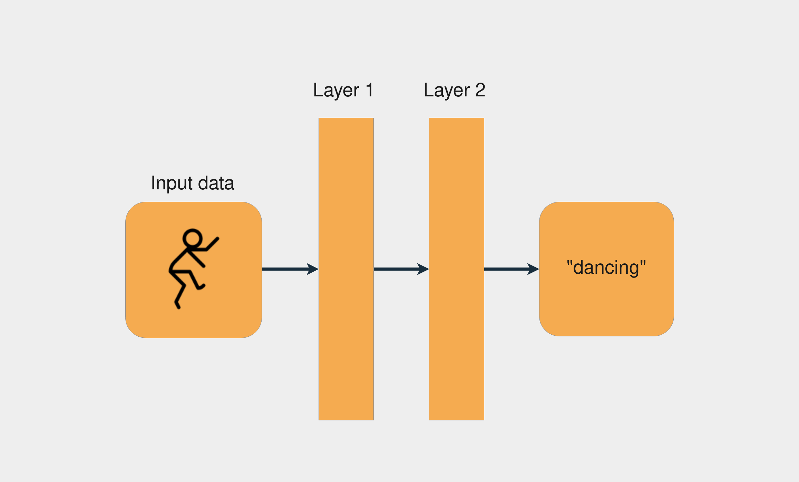
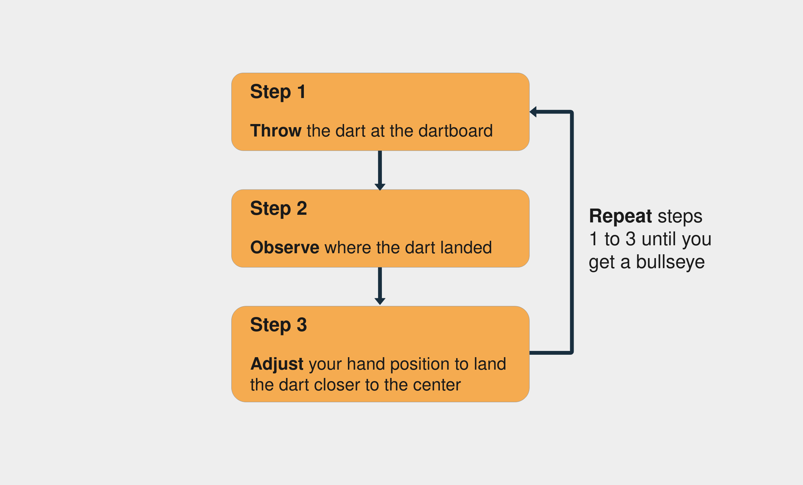

# AI - Neural Networks Concept
A neural network is a system that learns how to make predictions by following these steps:
1. Taking the input data.
2. Making a prediction.
3. Comparing the prediction to the desired output.
4. Adjusting its internal state to predict correctly the next time.

# Description of how neural networks work
Vectors, layers, and linear regression are some of the building blocks of neural networks. The data is stored as vectors, and with Python you store these vectors in arrays. Each layer transforms the data that comes from the previous layer. You can think of each layer as a feature engineering step, because each layer extracts some representation of the data that came previously. One cool thing about neural network layers is that the same computations can extract information from any kind of data. This means that it doesn’t matter if you’re using image data or text data. The process to extract meaningful information and train the deep learning model is the same for both scenarios.

**In the image below, you can see an example of a network architecture with two layers:**

Each layer transforms the data that came from the previous layer by applying some mathematical operations.
# The Process to Train a Neural Network
Training a neural network is similar to the process of trial and error. Imagine you’re playing darts for the first time. In your first throw, you try to hit the central point of the dartboard. Usually, the first shot is just to get a sense of how the height and speed of your hand affect the result. If you see the dart is higher than the central point, then you adjust your hand to throw it a little lower, and so on.

**These are the steps for trying to hit the center of a dartboard:**

Notice that you keep assessing the error by observing where the dart landed (step 2). You go on until you finally hit the center of the dartboard. With neural networks, the process is very similar: you start with some random weights and bias vectors, make a prediction, compare it to the desired output, and adjust the vectors to predict more accurately the next time. The process continues until the difference between the prediction and the correct targets is minimal. Knowing when to stop the training and what accuracy target to set is an important aspect of training neural networks, mainly because of overfitting and underfitting scenarios.

# Vectors and Weights
Working with neural networks consists of doing operations with vectors. You represent the vectors as multidimensional arrays. Vectors are useful in deep learning mainly because of one particular operation: the dot product. The dot product of two vectors tells you how similar they are in terms of direction and is scaled by the magnitude of the two vectors.
The main vectors inside a neural network are the weights and bias vectors. Loosely, what you want your neural network to do is to check if an input is similar to other inputs it’s already seen. If the new input is similar to previously seen inputs, then the outputs will also be similar. That’s how you get the result of a prediction.

# The Linear Regression Model
Regression is used when you need to estimate the relationship between a dependent variable and two or more independent variables. Linear regression is a method applied when you approximate the relationship between the variables as linear. The method dates back to the nineteenth century and is the most popular regression method.
`Note:` 
A linear relationship is one where there’s a direct relationship between an independent variable and a dependent variable.
By modeling the relationship between the variables as linear, you can express the dependent variable as a weighted sum of the independent variables. So, each independent variable will be multiplied by a vector called weight. Besides the weights and the independent variables, you also add another vector: the bias. It sets the result when all the other independent variables are equal to zero.
As a real-world example of how to build a linear regression model, imagine you want to train a model to predict the price of houses based on the area and how old the house is. You decide to model this relationship using linear regression. 
The following code block shows how you can write a linear regression model for the stated problem in pseudocode:

` price = (weights_area * area) + (weights_age * age) + bias `

In the above example, there are two weights: weights_area and weights_age. The training process consists of adjusting the weights and the bias so the model can predict the correct price value. To accomplish that, you’ll need to compute the prediction error and update the weights accordingly.

These are the basics of how the neural network mechanism works. Now it’s time to see how to apply these concepts using Python.

